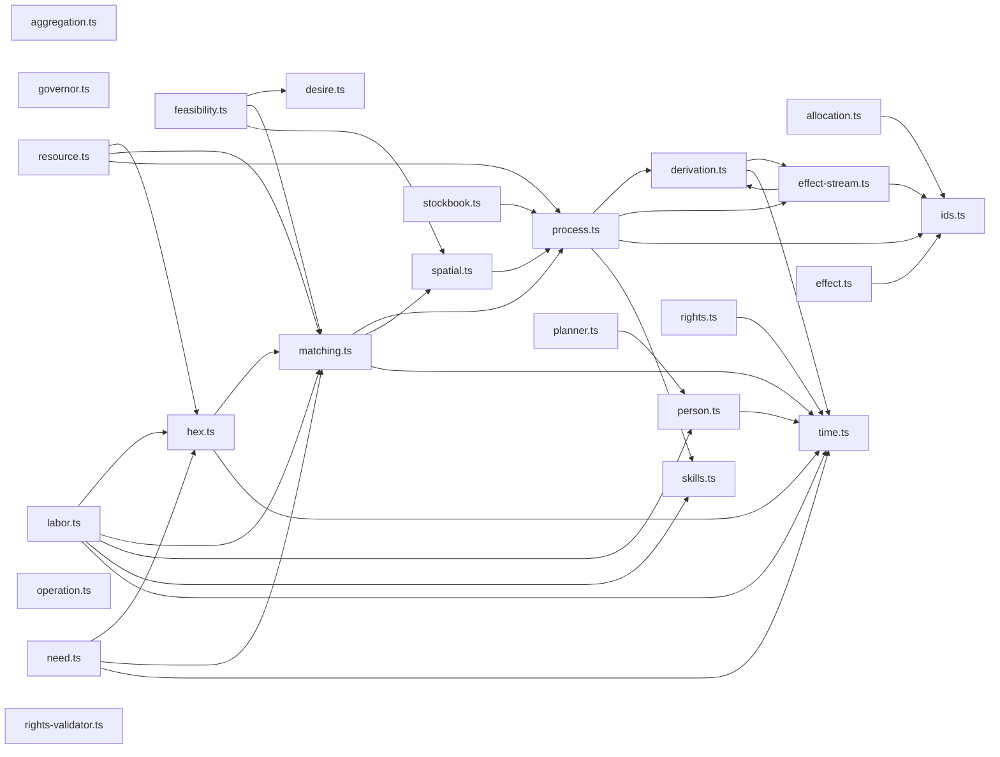

# Dependency Tree: `src/lib/core/plan`

This document provides a hierarchical view of the dependencies in `src/lib/core/plan`, followed by a Mermaid graph.

## Text Tree

- `aggregation.ts`
- `allocation.ts`
  - `ids.ts`
- `effect.ts`
  - ↪️ `ids.ts` (Already detailed above)
- `feasibility.ts`
  - `desire.ts`
  - `matching.ts`
    - `process.ts`
      - `derivation.ts`
        - `effect-stream.ts`
          - 🔄 `derivation.ts` (Circular Reference)
          - ↪️ `ids.ts` (Already detailed above)
        - `time.ts`
      - ↪️ `effect-stream.ts` (Already detailed above)
      - ↪️ `ids.ts` (Already detailed above)
      - `skills.ts`
    - `spatial.ts`
      - ↪️ `process.ts` (Already detailed above)
    - ↪️ `time.ts` (Already detailed above)
  - ↪️ `spatial.ts` (Already detailed above)
- `governor.ts`
- `labor.ts`
  - `hex.ts`
    - ↪️ `matching.ts` (Already detailed above)
    - ↪️ `time.ts` (Already detailed above)
  - ↪️ `matching.ts` (Already detailed above)
  - `person.ts`
    - ↪️ `time.ts` (Already detailed above)
  - ↪️ `skills.ts` (Already detailed above)
  - ↪️ `time.ts` (Already detailed above)
- `need.ts`
  - ↪️ `hex.ts` (Already detailed above)
  - ↪️ `matching.ts` (Already detailed above)
  - ↪️ `time.ts` (Already detailed above)
- `operation.ts`
- `planner.ts`
  - ↪️ `person.ts` (Already detailed above)
- `resource.ts`
  - ↪️ `hex.ts` (Already detailed above)
  - ↪️ `matching.ts` (Already detailed above)
  - ↪️ `process.ts` (Already detailed above)
- `rights-validator.ts`
- `rights.ts`
  - ↪️ `time.ts` (Already detailed above)
- `stockbook.ts`
  - ↪️ `process.ts` (Already detailed above)

## Mermaid Graph

