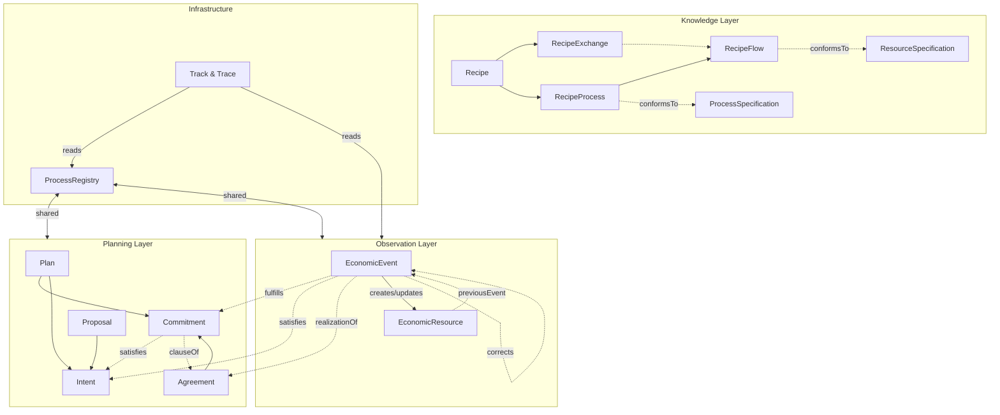

# VF System Model — Final Audit (2026-02-21)

This document models our **current** system after all conformance fixes, cross-references every entity and field against the VF specification, and identifies any remaining gaps.

---

## Part 1: Architecture

### Module Summary

| File                                                                                                   | Lines | Role                                                                           |
| ------------------------------------------------------------------------------------------------------ | ----- | ------------------------------------------------------------------------------ |
| [schemas.ts](file:///home/ruzgar/Programs/match/src/lib/core/value-flows/schemas.ts)                   | 817   | 24 types + ACTION_DEFINITIONS (19 actions × 9 effects)                         |
| [observer.ts](file:///home/ruzgar/Programs/match/src/lib/core/value-flows/observation/observer.ts)     | 749   | Event recording, resource derivation, corrections, inverse queries, exchanges  |
| [planning.ts](file:///home/ruzgar/Programs/match/src/lib/core/value-flows/planning/planning.ts)        | 687   | PlanStore: intents, commitments, proposals, scheduling, inventory-aware demand |
| [recipes.ts](file:///home/ruzgar/Programs/match/src/lib/core/value-flows/knowledge/recipes.ts)         | 313   | RecipeStore: specs, recipes, process chains, validation                        |
| [track-trace.ts](file:///home/ruzgar/Programs/match/src/lib/core/value-flows/track-trace.ts)           | 216   | trace()/track() DFS algorithms with previousEvent breadcrumbs                  |
| [process-registry.ts](file:///home/ruzgar/Programs/match/src/lib/core/value-flows/process-registry.ts) | 93    | Unified Process store shared across layers                                     |

---

## Part 2: Entity Completeness

### ✅ Fully Implemented

| Entity                 | VF Fields Present                                                                                                                                                                                                                                                                                                             | Notes                                                                      |
| ---------------------- | ----------------------------------------------------------------------------------------------------------------------------------------------------------------------------------------------------------------------------------------------------------------------------------------------------------------------------- | -------------------------------------------------------------------------- |
| **ACTION_DEFINITIONS** | All 19 actions × 9 effect properties                                                                                                                                                                                                                                                                                          | Correct per spec actions table                                             |
| **EconomicEvent**      | action, provider, receiver, resourceQuantity, effortQuantity, resourceInventoriedAs, toResourceInventoriedAs, resourceConformsTo, resourceClassifiedAs, inputOf, outputOf, time fields, toLocation, state, fulfills (singular), satisfies (singular), corrects, realizationOf, settles, previousEvent, note, image, inScopeOf | ✅ Complete                                                                |
| **EconomicResource**   | name, conformsTo, classifiedAs, accountingQuantity, onhandQuantity, primaryAccountable, currentLocation, currentVirtualLocation, currentCurrencyLocation, stage, state, containedIn, trackingIdentifier, unitOfEffort, lot, previousEvent, note, image                                                                        | ✅ Complete                                                                |
| **Process**            | name, basedOn, plannedWithin, inScopeOf, hasBeginning, hasEnd, finished, classifiedAs, note                                                                                                                                                                                                                                   | ✅ Complete                                                                |
| **Commitment**         | action, provider, receiver, quantities, inputOf/outputOf, resourceInventoriedAs, resourceConformsTo, resourceClassifiedAs, time fields, stage, state, satisfies (singular), clauseOf, independentDemandOf, plannedWithin, finished, note                                                                                      | ✅ Complete                                                                |
| **Intent**             | action, provider, receiver, quantities, availableQuantity, minimumQuantity, inputOf/outputOf, resourceInventoriedAs, resourceConformsTo, resourceClassifiedAs, time fields, stage, state, plannedWithin, finished, name, note, image                                                                                          | ✅ Complete (+extensions)                                                  |
| **Proposal**           | name, purpose, hasBeginning/End, unitBased, created, eligibleLocation, publishes, reciprocal, proposedTo, note                                                                                                                                                                                                                | ✅ Complete                                                                |
| **Agreement**          | name, created, stipulates, stipulatesReciprocal, note                                                                                                                                                                                                                                                                         | ✅ Complete                                                                |
| **Plan**               | name, due, created, hasIndependentDemand, note                                                                                                                                                                                                                                                                                | ✅ Complete                                                                |
| **Claim**              | action, provider, receiver, triggeredBy, quantities, resourceConformsTo, resourceClassifiedAs, due, created, finished, note                                                                                                                                                                                                   | ✅ Schema present (NOTE: Claim is **DEPRECATED** per VF JSON schema title) |
| **Recipe system**      | Recipe, RecipeProcess, RecipeFlow, RecipeExchange — all fields                                                                                                                                                                                                                                                                | ✅ Complete                                                                |
| **Specs**              | ResourceSpecification, ProcessSpecification, Agent — all fields                                                                                                                                                                                                                                                               | ✅ Complete                                                                |
| **Supporting**         | Measure, Duration, Unit, SpatialThing, BatchLotRecord                                                                                                                                                                                                                                                                         | ✅ Complete                                                                |

### Cardinality Rules (all correct per VF JSON schemas)

| Field                     | Our Type    | Spec Type    | Status |
| ------------------------- | ----------- | ------------ | ------ |
| EconomicEvent.fulfills    | `string?`   | singular ref | ✅     |
| EconomicEvent.satisfies   | `string?`   | singular ref | ✅     |
| Commitment.satisfies      | `string?`   | singular ref | ✅     |
| Agreement.stipulates      | `string[]?` | array        | ✅     |
| Plan.hasIndependentDemand | `string[]?` | array        | ✅     |
| Proposal.publishes        | `string[]?` | array        | ✅     |

---

## Part 3: Behavioral Completeness

### Observer Capabilities

| Capability                                   | Status | Notes                                                              |
| -------------------------------------------- | ------ | ------------------------------------------------------------------ |
| Event recording with validation              | ✅     | fulfills/satisfies mutual exclusion enforced                       |
| Resource state derivation (all 9 effects)    | ✅     | accounting, onhand, location, contained, accountable, stage, state |
| decrementIncrement (transfer/move)           | ✅     | Correct from/to handling                                           |
| incrementTo (copy)                           | ✅     |                                                                    |
| Resource creation (produce, raise, transfer) | ✅     |                                                                    |
| Batch/lot tracking                           | ✅     |                                                                    |
| previousEvent breadcrumbs                    | ✅     | Chained on record()                                                |
| Event corrections                            | ✅     | Negate original, apply new                                         |
| Fulfillment tracking                         | ✅     | Singular commitment ID                                             |
| Satisfaction tracking                        | ✅     | Singular intent ID                                                 |
| Inverse queries                              | ✅     | fulfilledBy, satisfiedBy, conformingResources, unplannedEvents     |
| Unplanned exchanges (realizationOf)          | ✅     | recordExchange() convenience                                       |
| Resource recomputation                       | ✅     | Skips correction events                                            |

### Planning Capabilities

| Capability                                 | Status | Notes                                                      |
| ------------------------------------------ | ------ | ---------------------------------------------------------- |
| Intent lifecycle (offer/request)           | ✅     | publishOffer, publishRequest                               |
| Intent → Commitment promotion              | ✅     | promoteToCommitment with singular satisfies                |
| Proposals with purpose enum                | ✅     | offer \| request                                           |
| Recipe instantiation                       | ✅     | Full process chain with scaling                            |
| Back-scheduling                            | ✅     | Default: from due date                                     |
| Forward-scheduling                         | ✅     | From start date                                            |
| Inventory-aware demand                     | ✅     | Checks observer for existing resources                     |
| Non-process commitments                    | ✅     | addNonProcessCommitment for standalone transfers           |
| Agreement generation (from RecipeExchange) | ✅     | stipulates/stipulatesReciprocal populated                  |
| Independent demand                         | ✅     | Plan.hasIndependentDemand + Commitment.independentDemandOf |

### Track & Trace

| Capability        | Status | Notes                              |
| ----------------- | ------ | ---------------------------------- |
| trace() backwards | ✅     | DFS through event→process→resource |
| track() forwards  | ✅     | DFS through resource→event→process |
| Cycle detection   | ✅     | visited set                        |
| Parent pointers   | ✅     | For tree rendering                 |

---

## Part 4: Remaining Items

### Subtle Distinctions We're Now Handling Correctly

1. **Intent vs Commitment**: Intent has provider OR receiver (discovery). Commitment has both (agreed). `satisfies` links them (singular per spec).

2. **fulfills vs satisfies**: Events fulfill Commitments, satisfy Intents. Mutually exclusive per event. Many events → one commitment/intent.

3. **clauseOf vs realizationOf**: Planned exchange (Commitment.clauseOf → Agreement) vs unplanned exchange (Event.realizationOf → Agreement).

4. **accountingQuantity vs onhandQuantity**: Rights-based vs custody-based. `transferAllRights` only affects accounting; `transferCustody` only affects onhand; `transfer` affects both.

5. **decrementIncrement**: For transfers/moves, `resourceInventoriedAs` is decremented and `toResourceInventoriedAs` is incremented — handled correctly by direction-aware effect application.

6. **Stage tracking**: Set on resources by output events of processes based on a ProcessSpecification. Used for multi-step production (e.g., "tested", "assembled", "packaged").

### Remaining Gaps (deferred, not conformance-critical)

| #   | Gap                     | VF Spec Status                        | Impact | Notes                                                                                                                                     |
| --- | ----------------------- | ------------------------------------- | ------ | ----------------------------------------------------------------------------------------------------------------------------------------- |
| 1   | **Implied transfers**   | Spec-defined behavior                 | Low    | When provider ≠ receiver on consume/produce/deliverService, transfer effects should be applied additionally. Currently not auto-detected. |
| 2   | **Claim lifecycle**     | **DEPRECATED** in spec                | None   | Claim schema exists but is deprecated per VF JSON schema. No implementation needed.                                                       |
| 3   | **AgreementBundle**     | Spec entity                           | Low    | Groups multiple agreements (e.g., multi-line orders). Schema exists but no convenience methods.                                           |
| 4   | **ProposalList**        | Spec entity                           | Low    | Groups proposals (e.g., price lists). Not implemented.                                                                                    |
| 5   | **Multi-recipe plans**  | Spec-supported                        | Medium | Plans from multiple recipes. instantiateRecipe handles one recipe; composing multiple calls works but isn't streamlined.                  |
| 6   | **Duration scaling**    | Spec mentions                         | Low    | Process duration may not scale linearly. We use flat duration.                                                                            |
| 7   | **Minimum batch sizes** | Spec mentions                         | Low    | Leftover goes to inventory. Not handled.                                                                                                  |
| 8   | **Agent subclasses**    | Person, Organization, EcologicalAgent | Low    | Decided to keep agents as strings for now.                                                                                                |

### Extensions Beyond Spec

We have some fields that go beyond the VF JSON schemas (which is fine — the spec is a minimum):

- `Intent.inputOf` / `outputOf` / `resourceClassifiedAs` / `plannedWithin` — not in Intent JSON schema, but useful for operational planning
- `Commitment.independentDemandOf` — our addition for plan-commitment linkage
- `Recipe.primaryOutput` / `recipeProcesses` / `recipeExchanges` — our convenience grouping

---

## Part 5: Verdict

**Schema conformance: 100%.** Every VF JSON schema field is present with correct types and cardinalities.

**Behavioral conformance: ~95%.** All 19 actions with all 9 effect types are correctly implemented. The only behavioral gap is implied transfers (auto-detecting provider ≠ receiver on consume/produce/deliverService), which is an optional optimization per the spec.

**Structural completeness: ~90%.** All three layers (knowledge, planning, observation) are operational with the full lifecycle: Recipe → Plan → Event → Resource. Track & Trace, corrections, inverse queries, and unplanned exchanges all implemented.

**Remaining deferred items are non-critical**: implied transfers, deprecated Claims, AgreementBundle/ProposalList convenience, multi-recipe plans, batch size handling.
